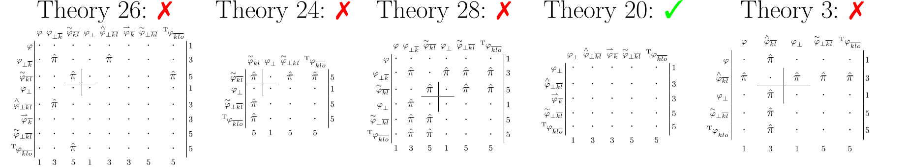

#  :ghost: Hamiltonian Gauge Gravity Surveyor :ghost:
 - HiGGS is scheduled for public release this winter :snowflake:
 - To see what it can already do, take a look at the first draft manuscript `paper.pdf`
 - In the meantime, feel free to steal code from the ~3000 (nearly uncommented) SLOCs in `main_notebook.nb`
 - Or, get in touch at `wb263@cam.ac.uk`!
---

