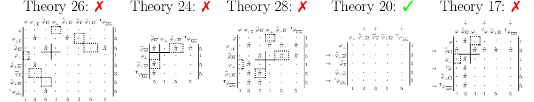
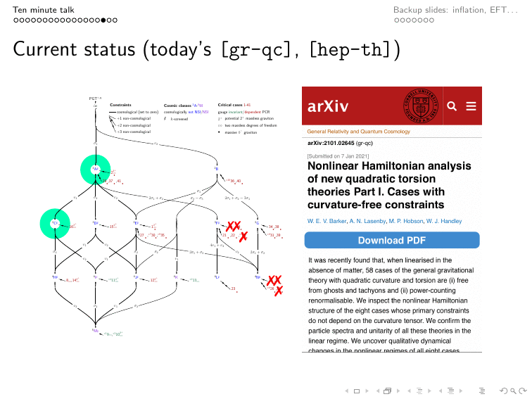
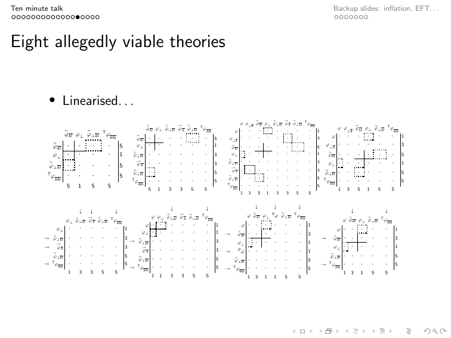

#  :warning: PREPRINT [arXiv_2101.02645.pdf](https://arxiv.org/abs/2101.02645) NOW FINISHED :warning:
##  :warning: new website [wevbarker.com](http://www.wevbarker.com) (temporary notification on all my public repos) :warning:
#  :ghost: Hamiltonian Gauge Gravity Surveyor :ghost:
 - `HiGGS` is scheduled for public release in winter 2020 :snowflake:
 - **To see what it can already do, take a look at the first preprint `arXiv_2101.02645.pdf`**
 - In the meantime, feel free to steal code from the ~3000 (nearly uncommented) SLOCs in `HiGGS_source_code/main_notebook.nb`
 - Or, get in touch at `wb263@cam.ac.uk`!
---

## What is `HiGGS`?

`HiGGS` is a Mathematica package for the xAct tensor algebra suite, which implements the Dirac-Bergmann algorithm across the space of possible gauge gravity theories. Currently `HiGGS` can make strong claims about the particle content and health of Poincaré gauge theories (PGT) of gravity, i.e. theories containing up to quadratic invariants in the Riemann and torsion tensors, with a 10-parameter Lagrangian:

Throughout 2021 I aim to extend the code to Weyl and metric-affine gauge theories (WGT/eWGT/MAGT).

## Some slides from a recent talk for LMU Munich

