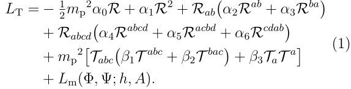

#  :ghost: Hamiltonian Gauge Gravity Surveyor :ghost:
 - `HiGGS` is scheduled for public release in winter 2020 :snowflake:
 - **To see what it can already do, take a look at the first draft manuscript `paper.pdf`**
 - In the meantime, feel free to steal code from the ~3000 (nearly uncommented) SLOCs in `main_notebook.nb`
 - Or, get in touch at `wb263@cam.ac.uk`!
---
\

## What is `HiGGS`?

`HiGGS` is a Mathematica package for the xAct tensor algebra suite, which implements the Dirac-Bergmann algorithm across the space of possible gauge gravity theories. Currently `HiGGS` can make strong claims about the particle content and health of Poincaré gauge theories (PGT) of gravity, i.e. theories containing up to quadratic invariants in the Riemann and torsion tensors:

\

